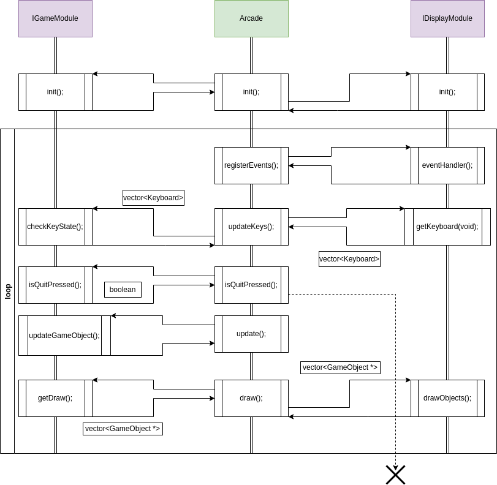

GOLDEN ARCADE ENGINE
===================================

Introduction
===================================

We focused on ease of usage and simplicity when developping our game
engine. You won\'t be able to develop complex games but you will be able
to develop simple games with fast and easily. We provided you with all
th e documentation you needenjoy. Feedback and optimizations are
appreciated.

Composition
====================================

Our engine is composed with several classes, namespaces, enums,
structures and templates. These are listed below

Namespaces
--------------------------------------

We put our whole game engine in the Arcade
namespace in order to avoid confusion if other libraries are being used
with this one.

Classes
---------------------------------

Our library comes with several classes who will help you finish this
project.

-   Arcade
-   IGameModule
-   IDisplayModule
-   Time
-   FpsLimiter
-   Error
-   GameObject

Templates
------------------------------------

We provided you with a template class who will load the libraries
automatically for you.

See also
:   DLLoader

Structures
-----------------------------------

There is only one structure provided in this engine. All the nessesary
information is documented:

See also
:   VectorXY

Enumerations
-----------------------------------

We made our own Keyboard type:

See also
:   Keyboard

Unions
-----------------------------------

The pixelData union will facilitate creating pixels
See also
:   pixelData

Architecture
==========================================

This is the sequence diagram of our architecture.

Ressources
======================================

Some ressources who justify the implementation of certain classes and
gave some ideas. Feel free to take a look.

-   Timesteps: <https://www.gafferongames.com/post/fix_your_timestep/>
-   Game dev: <http://gameprogrammingpatterns.com/contents.html>

Authors
=================================

This article was written by:

Author
:   Santana Graham
:   Vindevogel Victor

------------------------------------------------------------------------